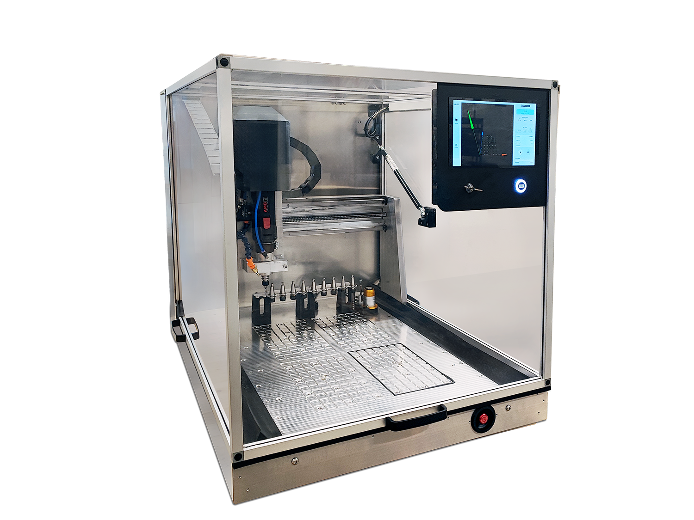
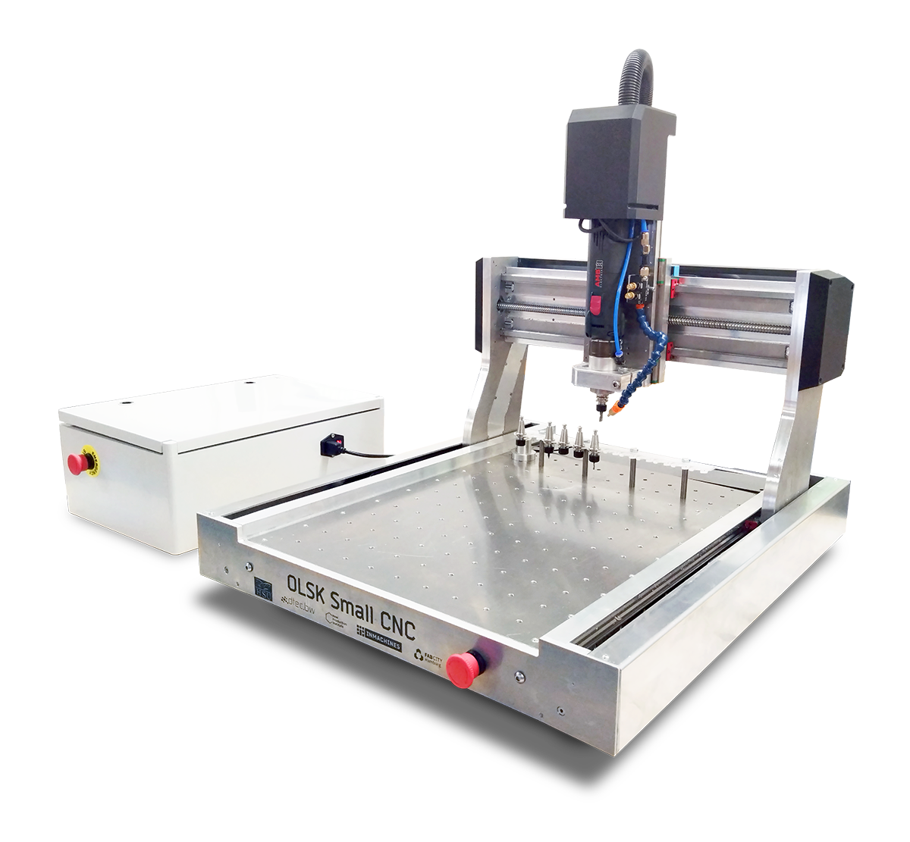
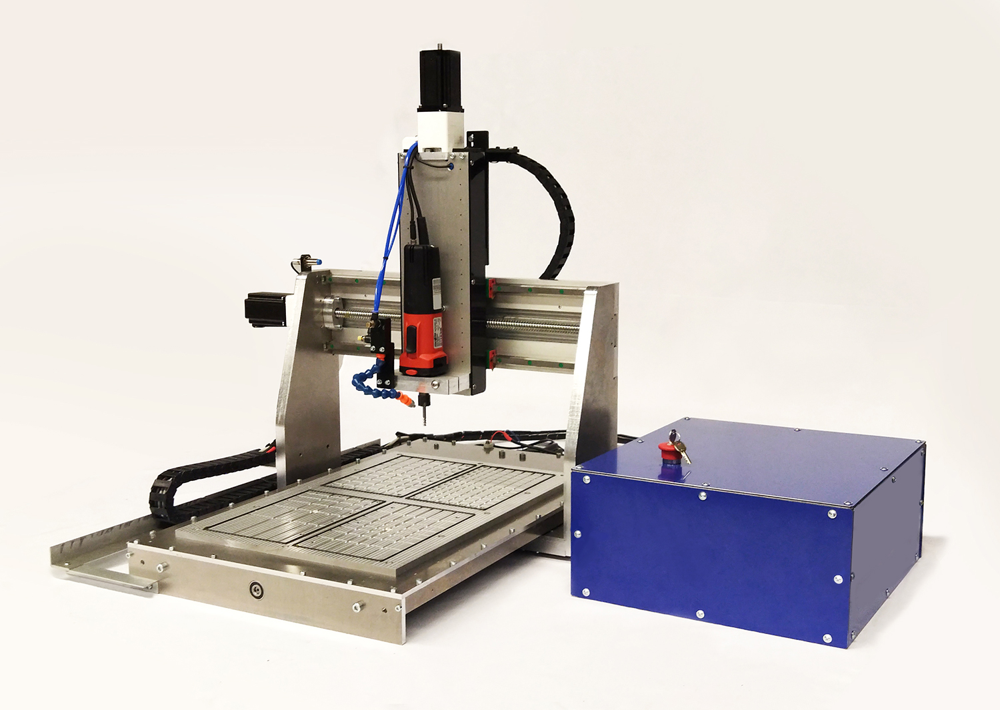

<h1 style=align="center">OLSK Small CNC V3</h1>

<i>Open Source CNC Milling machine - Small version - Open Lab Starter Kit</i>

 

Introduction
--

The OLSK Small CNC V3 is a desktop CNC milling machine with an innovative open-source tool changer, one of the first in an open-source machine. 

The Assembly Manual
--

All OLSK machines are open source and have the BOM and necessary files available in this repository for replication. The assembly of parts is also documented in a workbook where each step contains a list of parts, tools and instruction remarks, following a logical order to provide a smooth assembly.

- **[Assembly Manual](https://open-lab-starter-kit.github.io/OLSK-Small-CNC/)**

Specifications V3
--

- machine external dimensions: W740mm x D960mm x H800mm (~H1600mm open door)
- working area: W400mm x D530mm
- Automatic tool changer (capacity: 10 tools)
- Automatic tool measurement
- Automatic tool cleaning
- Coolant System
- Integrated liftable full-enclosed housing
- Flush-mounted 24V emergency stop
- Key Operated
- Universal bed (fixture clamping and vacuum)
- Closed Loop DC Servo Motors
- Belt decoupling on all axes
- Mounted touch screen
- Software: OLOS

Files
--

- **[CAD](cad)**
- **[Firmware](firmware)**
- **[Settings](settings)**
- **[BOM](OLSK_Small_CNC_V3-BOM.xlsx)**
- **[Wiring Schematic](OLSK_Small_CNC_V3_WiringSchematic.pdf)**
  
Author
--

OLSK Small CNC has been designed and built by **[InMachines Ingrassia GmbH](https://www.inmachines.net/)**.

<be>

Machine design:
- **[Daniele Ingrassia](https://www.linkedin.com/in/danieleingrassia/)**

PCB Design: 
- **[Wilhelm Schütze](http://fabacademy.org/archives/2015/sa/students/schutze.wilhelm/index.html)**

The machine is part of the **[Open Lab Starter Kit (OLSK)](https://www.inmachines.net/open-lab-starter-kit)** group of open source digital fabrication machines.

OLSK is developed by **[InMachines Ingrassia GmbH](https://www.inmachines.net/)** for the **[Dtec project](https://dtecbw.de/home/forschung/hsu/projekt-fabcity)** at **[Fab City Hamburg](https://www.fabcity.hamburg/en/)**.

OLSK Partners:
  

Contact
--

- daniele@inmachines.net
- [https://www.inmachines.net/](https://www.inmachines.net/)

License
--

Hardware design, CAD and PCB files, BOM, settings and other technical or design files are released under the following license:

- CERN Open Hardware Licence Version 2 Weakly Reciprocal - **[CERN-OHL-W](LICENSE_CERN_OHL_W_V2.txt)**

Assembly manual, pictures, videos, presentations, description text and other type of media are released under the following license:

- Creative-Commons-Attribution-ShareAlike 4.0 International - **[CC BY-SA 4.0](LICENSE_CC_BY_SA_4.0.txt)**

Previous Version
--

The previous versions of OLSK machines will always be available.

**[OLSK Small CNC Milling Machine V2](OLSK_Small_CNC_V1)**
   

**[OLSK Small CNC Milling Machine V1](OLSK_Small_CNC_V1)**
   

